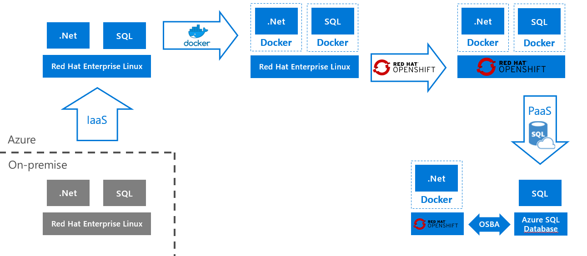

- [Context](#context)
- [VM](#vm)
- [Ansible](#ansible)
- [Docker](#docker)
- [VSTS](#vsts)
  - [Build](#build)
  - [Release](#release)
- [OSBA](#osba)
- [Resources](#resources)

# Context

This repository has been built to showcase some integrations between RedHat and Microsoft Azure: RHEL75 VM, ASP.NET Core 2.1, SQL Server on Linux, Docker, Azure Container Registry (ACR), OpenShift Container Platform (OCP), Visual Studio Team Services (VSTS), Open Service Broker for Azure (OSBA), etc.

You could find [here the presentations](http://bit.ly/14juin2018) (in French) we presented in Quebec city on June, 14 2018.

The goal is demonstrate a typical flow of a modernization journey: from on-premise, to public cloud IaaS, then going more agile with Containers, to leverage more platform capabilities with OCP and then finally take advantage of your SQL database as a Service:



# VM

Prerequisities:
- A **Red Hat Enterprise Linux 7.5 (RHEL)** VM
- ASP.NET Core 2.1 installed
- Two "Inbound port rule" on the associated "Azure Network Security Group", one for the port 1433 and the other for the port 88 to allow external connections to the web app and to the database endpoint.
- On your local machine, a "[SQL Operations Studio](https://docs.microsoft.com/en-us/sql/sql-operations-studio/download?)" installed

From your local machine, connect to the RHEL7 VM using SSH:
```	
ssh yourAdminUsername@ip_address_of_your_virtual_machine	
```
Download the Microsoft SQL Server Red Hat repository configuration file:	
```	
sudo curl -o /etc/yum.repos.d/mssql-server.repo https://packages.microsoft.com/config/rhel/7/mssql-server-2017.repo	
```
Install SQL Server 2017:	
```	
sudo yum install -y mssql-server	
```	
Configure SQL Server 2017:	
```	
sudo /opt/mssql/bin/mssql-conf setup	
```	
Once the configuration is done, verify that the service is running:	
```	
systemctl status mssql-server	
```	
To allow remote connections, open the SQL Server port on the firewall on RHEL (default port is TCP 1433):	
```	
sudo firewall-cmd --zone=public --add-port=1433/tcp --permanent	
sudo firewall-cmd --reload	
```	
	
*At this point*, SQL Server 2017 is running on your RHEL machine and is ready to use!

To setup the database for the purpose of this demo, from within the RHEL7 VM, run the following commands:
```
cd /var/opt/mssql/backup
wget https://github.com/Microsoft/sql-server-samples/releases/download/wide-world-importers-v1.0/WideWorldImporters-Full.bak
```

Using SQL Ops Studio on your local machine, connect to SQL Server 2017 on your virtual machine and run:
- this [restore.sql Script](https://raw.githubusercontent.com/erickangMSFT/sqldevops/master/docker_cluster/aks/restore.sql).
- and this [init-db.sql Script](./SqlServerAutoTuningDashboard/SqlScripts/init-db.sql).


Now let's setup the web application.

The web application is a simple dashboard to interact with Sql Server 2017 to demonstrate the AutoTuning feature.

*Note: This web application is coming from [this repository](https://github.com/Microsoft/sql-server-samples/tree/master/samples/features/automatic-tuning/force-last-good-plan). We migrated it to ASP.NET Core 2.1 and we made some simplifications and customizations, finally we enabled the Docker support.*

Now run the ASP.NET Core application from withing your RHEL7 VM, bu executing this command:
```
cd ~
git clone https://github.com/mathieu-benoit/RedHatOpenShiftAndMicrosoftAzureWorkshop.git
cd RedHatOpenShiftAndMicrosoftAzureWorkshop/SqlServerAutoTuningDashboard
dotnet restore
dotnet build
dotnet run
```

From your local machine, just point your browser to the URL http://rhel_ip_address:88/.

There is few features to demonstrate from this web dashboard page:
- Click on the Red "Regression" Button to trigger a degredation in performance and notice the impact on the gauge and the number of requests per second.
- Click on the On radio button below the gauge to activate SQL Server 2017's Automatic Tuning capability and notice the impact on the gauge and the number of requests per second that goes back up again automatically!


# Ansible

Are you looking for more automation to install SQL Server on your RHEL VM and also creating a SQL Database? Here you are! [Checkout these Ansible/Tower scripts by Michael Lessard](https://github.com/michaellessard/demoTower).

You could also look at [Michael's MSSQL role on Ansible Galaxy](https://galaxy.ansible.com/michaellessard/mssql/).

# Docker

Prerequisities:
- Docker CE has to be installed on the RHEL7 VM

*Important note: for the purpose of this demo we deployed both images SQL and Web as Ubuntu based images. It works on RHEL. But for production workload on OpenShift/RedHat and for better support, more performance and security compliance, you will modify the based images to target rhel based images.*

Let's now illustrate SQL Server 2017 support on Linux Containers. For that we created and pushed a [public Docker image here](https://hub.docker.com/r/mabenoit/my-mssql-linux/) which will contain the scripts for the purpose of this demo.

Pull the lastest version of the Docker image from the public image:
```
docker pull mabenoit/my-mssql-linux:latest
```

Run the Docker image from the public image:
```
docker run \
  -e 'ACCEPT_EULA=Y' \
  -e 'SA_PASSWORD=<sa-password>' \
  -p 1433:1433 \
  --name sql \
  -d mabenoit/my-mssql-linux:latest
```

And execute this command to initialize the database:
```
docker exec \
  sql \
  /usr/share/wwi-db-setup/init-and-restore-db.sh
```

*Optional - if you would like you could build the Docker image locally:*
```
cd SqlServerAutoTuningDashboard
docker build \
  -t my-mssql-linux \
  -f Dockerfile-Sql \
  .
```

Now, let's run the web application presented earlier in a Docker container. For the purpose of this demonstration, we've exposed its associated [public Docker image here](https://hub.docker.com/r/mabenoit/sql-autotune-dashboard/).

Pull the lastest version of the Docker image from the public image:
```
docker pull mabenoit/sql-autotune-dashboard:latest
```

Run the Docker image from the public image:
```
docker run \
  -e 'ConnectionStrings_Server=FIXME' \
  -e 'ConnectionStrings_Port=1433' \
  -e 'ConnectionStrings_Database=WideWorldImporters' \
  -e 'ConnectionStrings_UserId=SA' \
  -e 'ConnectionStrings_Password=<sa-password>' \
  -p 80:80 \
  --name web \
  -d mabenoit/sql-autotune-dashboard:latest
```

From your local machine, just point your browser to the URL http://rhel_ip_address:80/, where we could demonstrate the same features than previously.

*Optional - if you would like you could build the Docker image locally:*
```
cd SqlServerAutoTuningDashboard
docker build \
  -t sql-autotune-dashboard \
  -f Dockerfile-Web \
  .
```

# VSTS

In this section you will see how you could build and deploy your web and sql Docker images into your OpenShift Container Platform (OCP) cluster via Visual Studio Team Services (VSTS).

## Build

[](https://mabenoit-ms.visualstudio.com/_apis/public/build/definitions/f2b899c8-a46f-4300-a9fd-cc3bd7f6f15e/52/badge)

The goal here is to build and push both images: SQL and Web in a private Azure Container Registry via VSTS and more specifically with VSTS Build.

Prerequisities:
- You need a VSTS account and project
- You need a Connection endpoint in VSTS to your Azure Container Registry to be able to push your images built

High level steps:
- Agent queue: `Hosted Linux Preview`
- Docker - Build Web image
- Docker - Push Web image
- Docker - Build Sql image
- Docker - Push Sql image
- Copy and publish Kubernetes' yml files as Build artifact for further deployments

See the details of this [build definition in YAML file here](./SqlServerAutoTuningDashboard/VSTS-CI.yml).


## Release

PRE-PROD: [](https://rmsprodscussu1.vsrm.visualstudio.com/Ae373a2ff-a162-446f-b7ec-415465e9e56c/_apis/public/Release/badge/f2b899c8-a46f-4300-a9fd-cc3bd7f6f15e/4/6)

PROD: [](https://rmsprodscussu1.vsrm.visualstudio.com/Ae373a2ff-a162-446f-b7ec-415465e9e56c/_apis/public/Release/badge/f2b899c8-a46f-4300-a9fd-cc3bd7f6f15e/4/8)

The goal here is to deploy both images: SQL and Web on a given OpenShift Cluster via VSTS and more specifically with VSTS Release. The first environment `PRE-PROD` will be automatically provisioned in continuous integration/delivery whereas then the `PROD` environment will need manual approval.


Prerequisities:
- You need an OpenShift Origin or Container Platform cluster
- You need a VSTS account and project
- You need a Connection endpoint in VSTS to your Azure Container Registry to be able to create the associated secret in your OpenShift Kubernetes cluster
- You need a Connection endpoint in VSTS to your OpenShift Kubernetes cluster to be able to deploy your Docker images 

For the last prerequisities above, *Connection endpoint in VSTS to your OpenShift Kubernetes cluster*, here are the steps to achieve this:
- On your local machine, install the [OpenShift command line interface (CLI)](https://docs.openshift.com/container-platform/3.9/cli_reference/get_started_cli.html)
- Run `oc login <server-url>`, and provide either a token or your username/password
- Get the associated kube config file: `cat ~.kube/config` and keep the entire content, especially the one regarding this specific cluster if you have more than one.
- Go to to your VSTS project and navigate to your `/_admin/_services` page. There, add a new "Kubernetes service endpoint" filling out the `Server URL field` and the `KubeConfig`. You need also to enable the `Accept Untrusted Certificates` checkbox.
  - *Important remark: by default this token will be valid for 24h, so you will have to repeat these 3 previous commands then.*
- If you try out the "Verify connection" action you will get an error, ignore it, and click on the `OK` button

Variables:
- SqlDeployName = sql
- WebDeployName = web
- ACR_SERVER = your-acr-name.azurecr.io
- K8sNamespace = your-ocp-project
- SQL_SERVER = sql
- SQL_PORT = 1433
- SQL_DATABASE = WideWorldImporters
- SQL_USERID = SA
- SQL_PASSWORD = your-password

High level steps:
- Replace tokens in **/*.yml
  - Root directory = `$(System.DefaultWorkingDirectory)/SqlAutoTuneDashboard-ACR-CI/k8s-ymls/SqlServerAutoTuningDashboard`
  - Target files = `**/*.yml`
- kubectl apply - sql
  - Command = `apply`
  - Arguments = `-f $(System.DefaultWorkingDirectory)/SqlAutoTuneDashboard-ACR-CI/k8s-ymls/SqlServerAutoTuningDashboard/k8s-sql.yml`
  - Namespace = $(K8sNamespace)
  - Secrets
    - Azure Container Registry = your-acr
    - Secret name = `acr-secret`
- kubectl apply - web
  - Command = `apply`
  - Arguments = `-f $(System.DefaultWorkingDirectory)/SqlAutoTuneDashboard-ACR-CI/k8s-ymls/SqlServerAutoTuningDashboard/k8s-web.yml`
  - Namespace = $(K8sNamespace)
  - Secrets
    - Azure Container Registry = your-acr
    - Secret name = `acr-secret`


*Note: to achieve that and for the purpose of this demo, you should "[Enable Images to Run with USER in the Dockerfile](https://docs.openshift.com/container-platform/3.9/admin_guide/manage_scc.html#enable-images-to-run-with-user-in-the-dockerfile)" per namespace/project to have these images running properly.*

Once this Release succesfully deployed/exececuted and for the purpose of this demo you should manually run this command to initialize properly the database:
```
SQL_POD=$(kubectl get pods -l name=sql -n <your-namespace> -o jsonpath='{.items[0].metadata.name}')
kubectl exec \
  $SQL_POD \
  /usr/share/wwi-db-setup/init-and-restore-db.sh
```

You could now expose the web dashboard app by creating a `Route` and then hitting it's associated/generated `HOST/PORT`:
```
oc expose svc/web --name=web --namespace <your-namespace>
oc get route --namespace <your-namespace>
```


# OSBA

Prerequisities:
- You need an OpenShift Origin or Container Platform cluster
- You need to [install OSBA in your OpenShift cluster](https://github.com/Azure/open-service-broker-azure#openshift-project-template)

From the OCP Service Catalog you should be able to browse and use the different Azure APIs:


From there let's provision an `Azure SQL Database` (Server + Database). After providing some information like the Azure location, the resource group, the plan to use, the firewall rules to set up, etc. you will have the choice to generate and bind the associated `Secret` of this Azure SQL Database which will be provisioned in Azure for you. With this `Secret` info you will be able then to map the different keys within this `Secret` to associated environment variables of your web app deployment:


# Resources

- [How to prepare a Red Hat-based virtual machine for Azure](https://azure.microsoft.com/en-us/resources/how-to-prepare-a-red-hat-based-virtual-machine-for-azure)
- [Why switch to SQL Server 2017 on Linux?](https://info.microsoft.com/top-six-reasons-companies-make-the-move-to-sql-server-2017-register.html)
- [Install SQL Server 2017 on RedHat 7](https://docs.microsoft.com/en-us/sql/linux/quickstart-install-connect-red-hat?view=sql-server-linux-2017)
- [Enhancing DevOps with SQL Server on Linux](https://alwaysupalwayson.blogspot.com/2018/06/enhancing-devops-with-sql-server-on.html)
- [OpenShift on Azure installation](https://docs.microsoft.com/en-us/azure/virtual-machines/linux/openshift-get-started)
- [Provisioning OCP on Azure with Ansible](https://galaxy.ansible.com/michaellessard/mssql/)
- [Open Service Broker for Azure](https://osba.sh/)
- [Announcing .NET Core 2.1 for Red Hat Platforms](https://developers.redhat.com/blog/2018/06/14/announcing-net-core-2-1-for-red-hat-platforms/)
- [Remotely Debug an ASP.NET Core Container Pod on OpenShift with Visual Studio](https://developers.redhat.com/blog/2018/06/13/remotely-debug-asp-net-core-container-pod-on-openshift-with-visual-studio/)
